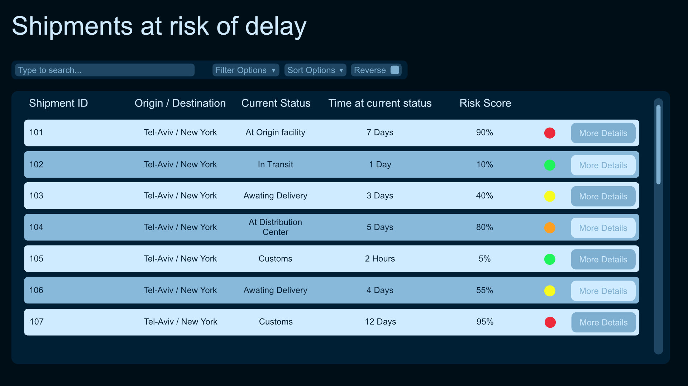

## Part 1 - Problem Analysis and System Design approach
#### Potential delay factors
##### Internal
- staffing shortages
- equipment/machinery failure rates
- more shipments than capacity of a facility's ability to handle at once causing a backlog
- shipment type (weight, fragility, hazardous material, etc...)
##### External
- bad weather / natural disasters
- political / civil unrest
- problems distribution centers such as congestion
- delays at ports / customs clearance
- customer purchasing habits
  
#### Early Delay Identification Factors
##### Types of data that could be used to measure risk delay
- **data:** amount of time shipment has spent at current stage.
  **reason to track:** this will allow us compare against other data to determine if something has gone wrong at the current stage of shipment.

- **data:** amount of time shipment is typically supposed to spend at each stage in the shipping process.
  **reason to track:** to have a point of comparison for the previous data type.
  
- **data:** throughput of handling facility in a given time span.
  **reason to track:** allows detection of potential problems at the facility which is handling the shipment, which would be indicated by lower throughput than expected/determined for the facility to be processing.
  
- **data:** attributes relating to the shipments characteristics.
  **reason to track:** data such as whether or not a shipment contains hazardous material could also indicate potential future delays, as the shipment might need special clearing at destinations.
  
- **data:** weather data at and around shipment routes.
  **reason to track:** extreme weather alerts could be strong indicators that a shipment traveling through the area might get delayed until such events pass, knowing this in advance will allow attempts to notify customers in advance.

- **data:** protest/strike events on shipment route or at target destination.
  **reason to track:** such events can halt processing of shipments at any point along the shipment's route, knowing about these in advance will allow notifying customers of delays at the very least.
  
- **data:** purchasing date.
  **reason to track:** using the purchase date we can compare with known customer purchasing habits such as "Black Friday" or "Amazon Prime" sales, which naturally bring a large influx of orders, with the rationale that there will be a delay for orders made in that time period because of the large volume of incoming orders.
  although this can be covered indirectly by tracking throughput of facilities during these times as well, but tracking and comparing the purchase date allows us to pinpoint the reason to specifically be the time-period.

#### System Implementation Approaches
##### Machine Learning Model:
This section looks at types of data that would be highly valuable in training a ML model for the system. some data is the same as written above, while other data might be uniquely valuable for a ML model as opposed to other systems.
 
Data relating to the **"performance" of the shipment along its route**, such as the time it spends at different handling stages should be collected. from this the model can realize patterns like "shipments usually take X amount of time at this stage, but this one took 3X the time" which would signify a delay.

A ML model would also benefit from data relating to the characteristics of the route a shipment is meant to take, such as **origin and destination**, and **mode of transportation**. It would learn patterns of shipments going through it regularly and pick up on potential delays due to factors such as recurring bad weather in the region, or notice if a region is particularly susceptible to instability.

Data on a **handling facility's past performance** can also help train a ML model on which facility's may be more prone to bottlenecks, which could be used to classify shipments going through there as more high risk for delays.
The same rationale can be made for collecting data on different **carriers' performance**.

**Pros:**
- The upside for this kind of system is the dynamic nature of its risk assessment. this results in less false positive (marked as at risk for delays when shouldn't be), or false negatives (not marked for delays when should be).
- This kind of system can learn of relationships between different factors, resulting in complex pattern recognition which cannot be replicated with a manually made list of rules. additionally the system scales better in terms of development (maintainability) and complexity (interplay between rules) with the addition of more rules as analysis and development goes on.
  
**Cons:**
- A major downside of a ML based system is cost of development - such a complex model would require a non-negligible investment of time and resources to build up.
- Another downside would be the need for high quality data. if the data the model is trained on is bad in various ways, it would lead the model to create wrong predictions.
- Additionally, depending on implementation, and because of the nature of the continuously updating data, a ML model might need to be retrained every so often, adding to maintenance costs.
- It is also more difficult to figure out why a model gave the output it did, so debugging it when a wrong prediction occurs becomes more difficult.

##### Rule-based System
In contrast with a ML model, a rule-based system is much simpler.
based on the data types collected, we can come up with rules such as "if the shipment has spent too much time at X stage -> increase risk of delay", or "if the facility handling this shipment has seen lower throughput recently or has shortage of staffing -> increase risk of delay". These rules can be used to come up with a "risk of delay" score, and passing a given threshold, be marked at risk and for the operations team to take a look at.
The rules can be combined in various ways for more specific scenario targeting, but this does not scale well with the addition of new rules and the complexity of real world events.
Rules can also be given different weight, so that we can designate certain problems as much greater risk for delay compared to others.

For this kind of system there are no special types of data we might want to collect. All the data mentioned above can be used to come up with different combinations of rules.

**Pros:**
- The main advantage of this approach is its simplicity, resulting is much lower development costs and resources compared to a ML model based system.
- Additionally if given wrong predictions, it is easier to debug and see where things went wrong, and the rules are all laid out plainly.

**Cons:**
- Similarly, the main disadvantage of this approach is also its simplicity.
  This kind of system cannot accurately take into account all the different ways real world data interacts and analyze it. if the interaction between different events or data types has not been implemented, it will not be considered. This can result in many wrong or missed predictions, as we ourselves cannot anticipate all the different interactions and implement them.
- This system also suffers from bad scalability. as more data types and the way they interact with each other are added to the system, it will become more difficult to maintain and debug.
#### System Choice
In the context of an **Initial** logistics system I would pick a Rule-based System.
The reason for this is simply because the development process to make such a ML model based system from the ground up would be too large without significant investment of time and resources.
The simpler rule-based system can be up and running more quickly, and will perform well as long as the scope doesnt get too large.
But I will also consider creating a ML model based system a very high priority when wanting to expand, because that kind of system is better at handling scale and the dynamism of the real world.
## Part 2 - UI Design
#### Dashboard Design




#### Communication between backend and frontend
The most fitting communication approach for this type of dashboard is **Server-Sent Events** (SSE).
This is for two primary reasons:
- We want the dashboard to update very frequently or even in real time, having the server update the client, as happens with SSE, means we dont have to keep asking the server for updates from the client and wait for responses, eliminating polling.
- Client does not need to send data to the server. this means there is no need for websockets, SSE is a one-way communication from the server to the client.
#### Data Structure for the Dashboard
JSON object example for simple shipment data:
```
    {
        "id": "101",
        "route": {
            "origin": "Tel-Aviv",
            "destination": "New York"
        },
        "currentStatus": "in-transit",
        "timeAtCurrentStatus": 60, // minutes
        "expectedDeliveryDate": 1764376941167, // ms
    }
```

I would prefer a denormalized data structure for this application.
That is because if we were to have a normalized data structure, when the UI wanted to render it, it would have to retrieve every piece of information that is bein referred to in the data. this causes unnecessary calls and wait time just for information that the UI should have gotten to begin with.
With a denormalized structure, all the information the UI needs to render is passed to it immediately, no need to go anywhere else in the code to retrieve those pieces of information, so the UI can simply render the data it is passed.
## Part 3 - Sample Data and Integration

**Please check the file `sample-shipments.json` for the sample data.
The script used to generate that data is also attached, named `generate-shipments.js`**
#### API Design
##### API Endpoints:
- GET `/shipments` - used to retrieve a list of all shipments at risk of delay.
  - additional filtering options can be passed as well such as: `/shipments?status=origin` or even a whole filtering object, using URLSearchParams.
- GET `/shipments/:id` - used to retrieve the shipment data of a specific shipment.
  Any time a shipment's data updates, e.g. the risk score was recalculated, or the status of the shipment changed, the server will give the client the new data for the UI to be updated.
- GET `/events/shipments` - sends the updated shipment data to the client, this is the connection which is kept open for the server to send new for display.

##### Inputs and Outputs
The server may hold our shipment data in a normalized format.
Because we decided that the client will receive denormalized data, we will need to convert normalize the data before sending it over. that is the first step.
In-case the backend's shipment data is more detailed than what is necessary for our dashboard, we may also want to clear unnecessary or sensitive fields.
Our `/events/shipment` endpoint sends an event of type `shipmentUpdate` with the data being an object containing only the updated shipment's data (and its ID), not the whole shipment data objects, so we will want to construct a new smaller object containing only information that changed.

All in all, getting a list of shipment data would look exactly as it does in the file `sample-shipments.json`.
Getting just one shipment data would look like one of the entries in that list.
Getting an updated object would look similar to the following:
```
    {
        "id": "101",
        "timeAtCurrentStatus": 0, // was 60 minutes
        "currentStatus": "awaiting-delivery", // was "in-transit"
    }
```
  
Where the id of the shipment is sent, following the data fields that were updated.
## Part 4 - Delay Logic Implementation
**Please see file** `is-at-risk.js`
